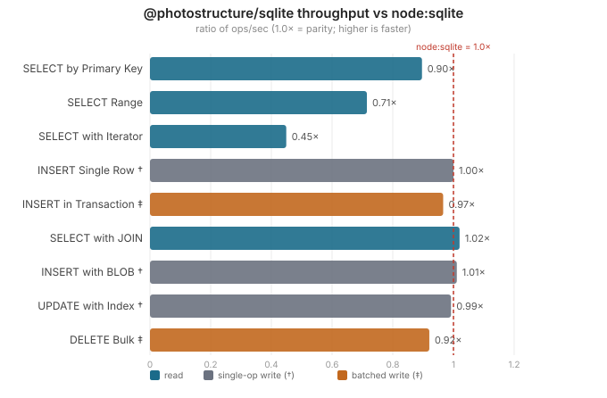

# SQLite driver benchmarks

## Is it fast enough?

**For most applications, yes.**

In our pinned benchmark run:

- Indexed single-row reads reach about 97,000 queries per second, within
  roughly 20% of the fastest driver.
- Durable single-row writes match `node:sqlite` and `better-sqlite3`; storage
  sync time dominates driver overhead.
- Joins and batched writes are in the same general range, though not always at
  parity.
- Large result sets are the known gap. Fetching or iterating roughly 1,000 rows
  at a time is 1.4x to 2.2x faster in `node:sqlite`, and `better-sqlite3` is
  faster still in both cases.

Even the slowest read cases here materialize more than 400,000 rows per second.
Most applications will not notice the difference. If large result sets sit in
a hot loop, benchmark your own workload before choosing a driver.



## Why bulk reads trail

Two independent effects drive the bulk-read results: JavaScript row construction
and, for the range fixture, SQLite page-cache policy.

For equal cache settings, the remaining gap is in constructing JavaScript rows.
`@photostructure/sqlite` uses stable Node-API and assigns each column to a
null-prototype row through a separate property call. The built-in `node:sqlite`
module can use V8-only bulk constructors inside Node.js.

`better-sqlite3` 13 also uses Node-API, but reduces call count with cached,
shape-specialized JavaScript row factories and a separate iterator-record
factory. In controlled spikes, removing our safe-integer check or switching to
ordinary-prototype allocation was flat; reproducing those factory call shapes
accounted for most of this package's binding-side deficit to `node:sqlite`.

The range row also reflects different packaged SQLite defaults:
`better-sqlite3` uses a 16 MiB page cache, while this package and `node:sqlite`
use 2 MiB. A controlled run pinning every driver to 2 MiB measured 413, 658,
and 583 ops/s, respectively. The table below intentionally reports out-of-box
defaults, so its range result combines cache policy and row-construction cost.

We keep the stable path because compatibility and predictable behavior matter
more than a benchmark-only win. The cost grows with the number of rows and
columns returned, which is why single-row queries stay close while 1,000-row
queries show the largest difference.

<details>
<summary>Full performance results</summary>

These results come from Linux x64 on an AMD Ryzen 9 5950X with Node.js 26.6 and
`better-sqlite3` 13.0.3. The process was pinned to one core with `taskset -c 2`
and run with `BENCH_TRIALS=30 BENCH_WARMUP=5`. The BLOB row was repeated with
the same settings after the full run encountered transient storage latency.
Absolute throughput varies by machine; the relationships between drivers are
the useful part.

| Scenario                | @photostructure/sqlite |      better-sqlite3 |         node:sqlite | vs node:sqlite |
| ----------------------- | ---------------------: | ------------------: | ------------------: | -------------: |
| SELECT by Primary Key   |     97,000 ops/s ±0.6% | 120,000 ops/s ±0.6% | 110,000 ops/s ±0.5% |          0.90x |
| SELECT Range            |        420 ops/s ±0.5% |   1,500 ops/s ±3.5% |     580 ops/s ±1.6% |          0.71x |
| SELECT with Iterator    |        520 ops/s ±0.8% |   1,400 ops/s ±1.1% |   1,100 ops/s ±1.2% |          0.45x |
| INSERT Single Row †     |         65 ops/s ±3.4% |      65 ops/s ±2.1% |      65 ops/s ±2.2% |          1.00x |
| INSERT in Transaction ‡ |         57 ops/s ±2.7% |      58 ops/s ±2.5% |      59 ops/s ±2.9% |          0.97x |
| SELECT with JOIN        |      1,700 ops/s ±1.4% |   1,700 ops/s ±0.4% |   1,600 ops/s ±0.7% |          1.02x |
| INSERT with BLOB †      |        730 ops/s ±1.6% |     730 ops/s ±0.4% |     720 ops/s ±1.8% |          1.01x |
| UPDATE with Index †     |        740 ops/s ±4.5% |     740 ops/s ±3.2% |     750 ops/s ±4.5% |          0.99x |
| DELETE Bulk ‡           |         81 ops/s ±3.9% |      83 ops/s ±3.3% |      88 ops/s ±4.6% |          0.92x |

† Single-operation writes commit once per operation. With rollback journaling
and `synchronous=FULL`, durable storage sync dominates and the drivers tie.

‡ Batched writes amortize one durable commit over roughly 1,000 rows, so driver
overhead remains visible. SQLite may issue multiple sync calls for a commit;
the exact sequence depends on the VFS and journaling details.

`ops/s` counts complete operations, not rows. `SELECT Range` and `SELECT with
Iterator` each materialize roughly 1,000 rows per operation. `INSERT in
Transaction` and `DELETE Bulk` each write roughly 1,000 rows per operation.

</details>

## Run the benchmarks

```bash
cd benchmark
npm install

# Full performance suite
npm run bench

# Packaged-cache sensitivity (leave each driver's compiled cache default)
npm run bench -- --cache-profile packaged

# Read scenarios only
npm run bench select

# Regenerate SVG charts
npm run bench:charts

# Memory leak checks
npm run bench:memory
```

Compare selected drivers or scenarios by passing arguments through to the
benchmark:

```bash
npm run bench -- select --drivers @photostructure/sqlite,node:sqlite
npm run bench -- --drivers @photostructure/sqlite,better-sqlite3,node:sqlite
```

<details>
<summary>Options, scenarios, and methodology</summary>

### Drivers

- `@photostructure/sqlite`: this package
- `better-sqlite3`: synchronous SQLite binding with its own API
- `node:sqlite`: the built-in Node.js module, when available

The asynchronous `sqlite3` package is not included. Its callback-based API is
not an apples-to-apples comparison with these synchronous drivers, and the
package is [effectively unmaintained](https://github.com/TryGhost/node-sqlite3/pull/1844).

If `better-sqlite3` has no prebuilt binary for your Node.js release, rebuild it
locally:

```bash
npm rebuild better-sqlite3 --build-from-source
```

### Performance options

- `--drivers <list>` selects a comma-separated driver list.
- `--iterations <n>` fixes the per-trial iteration count instead of calibrating.
- `--cache-profile controlled|packaged` selects the SQLite page-cache policy.
  `controlled` is the default. It sets `PRAGMA cache_size = -16000` for every
  driver. `packaged` leaves each driver's compiled cache default unchanged.
- `--verbose` prints detailed progress.
- `--memory` tracks memory during the performance run.
- `--help` prints all options.

Environment variables `BENCH_TRIALS` and `BENCH_WARMUP` control the number of
measured and warmup trials. Measured trials are clamped to a minimum of six,
which is required for the distribution-free 95% median interval.

### Performance scenarios

- `select-by-id`: one row by primary key
- `select-range`: roughly 1,000 rows by indexed key
- `select-iterate`: iterate over 1,000 rows
- `select-join`: join with aggregation
- `insert-simple`: one durable insert
- `insert-transaction`: 1,000 inserts in one transaction
- `insert-blob`: one durable insert with a 10 KB blob
- `update-indexed`: one durable indexed update
- `delete-bulk`: delete roughly 1,000 rows in one transaction

### Measurement method

The runner calibrates every driver for a scenario, then uses the largest result
as one shared iteration count. This gives every driver at least about 50 ms of
timed work and makes randomized scenarios execute the same access sequence.
Trials are interleaved across drivers. Results report the median and the
conservative relative half-width of an exact, distribution-free 95% confidence
interval for that median. All drivers use rollback journal mode and
`synchronous=FULL` so write durability is comparable. The default `controlled`
cache profile gives every driver the same 16 MiB target; the separate
`packaged` profile shows the policy users receive from each package. Negative
SQLite `cache_size` values are kibibyte targets, not page counts or eager
allocations. The runner prints the active profile and every driver's effective
settings before timing.

The published table and charts above predate the named profiles and used each
driver's packaged cache default, equivalent to today's `--cache-profile packaged`.

The `vs node:sqlite` column reports this package's throughput divided by
`node:sqlite` throughput for that scenario. We do not publish a blended score;
an average would let storage-bound write ties hide the read-path differences.

</details>

## Memory checks

The memory suite covers statement lifecycle, large selects, blobs,
transactions, and prepare-cache churn. It flags a leak only when growth exceeds
500 bytes per iteration and has an R² of at least 0.5, which helps reject noisy
runs.

```bash
npm run bench:memory

# Select drivers, scenarios, or a fixed iteration count
tsx --expose-gc memory-benchmark.ts \
  --drivers @photostructure/sqlite,better-sqlite3 \
  --scenarios prepare-finalize,large-select \
  --iterations 100
```

<details>
<summary>Memory benchmark options</summary>

- `--drivers <list>` selects drivers.
- `--scenarios <list>` selects memory scenarios.
- `--iterations <n>` sets the iteration count. Automatic calibration uses
  20-200 iterations.
- `--help` prints all options.

Run memory checks with `--expose-gc` so the harness can control garbage
collection.

</details>

## Adding a scenario

1. Add performance scenarios to `scenarios.ts`.
2. Add memory scenarios to `memory-benchmark.ts`.
3. Use the existing setup, run, and cleanup pattern.
4. Keep SQL and durability settings equivalent across drivers.

## License

Same as the parent project.
